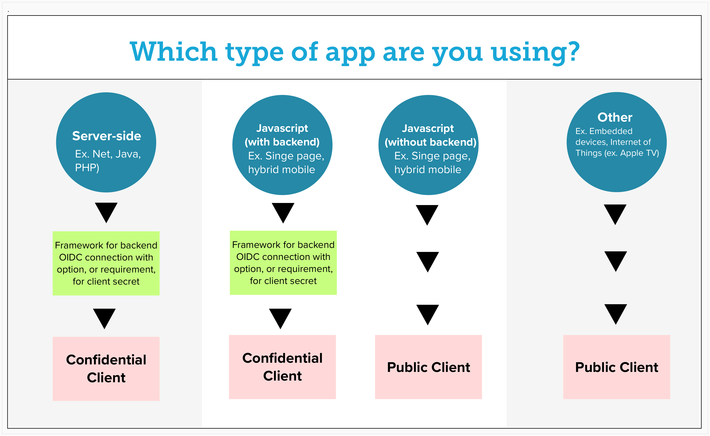

# Confidential vs Public Client

---

### Client Type Confidential vs Public 

When requesting a new client you can specify whether you want it set up as a _Confidential client_ or you want it set up as a _Public Client_ with PKCE.

With a confidential client, the back-end component securely stores an application secret that allows it to communicate with the KeyCloak server to facilitate the OIDC authentication process.

A public client is slightly less secure because there is no secret, but this configuration is required by some architectures and is supported as well. Public clients can use PKCE (Proof Key for Code Exchange) as a more secure flow.

PKCE provides dynamic client secrets, meaning your app’s client secrets can stay secret (even without a back end for your app). PKCE is better and more secure than the implicit flow (AKA the “token flow”). If you’re using the implicit flow, then you should switch to PKCE. If you use an implicit flow to authorize your Dropbox app, then PKCE is a better, more secure replacement, and you should no longer use implicit flow.

See the diagram below for use cases where each option is appropriate.
### Diagram

